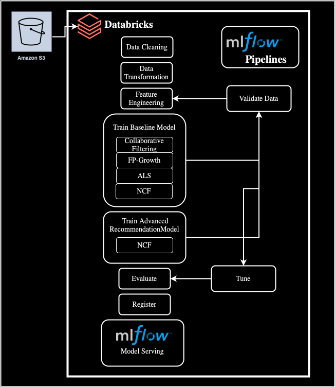

# **End-to-End Machine Learning Pipeline for Personalized Recommendations in Databricks**

## **Overview**

This project implements a comprehensive end-to-end machine learning pipeline in Databricks to deliver personalized product recommendations for an e-commerce platform. The pipeline integrates structured and unstructured data, enabling enhanced insights and predictions to optimize customer engagement and product recommendations.

**Problem Statement**: E-commerce platforms often struggle to provide highly personalized product recommendations that improve customer engagement and retention. Understanding customer behavior through interactions, reviews, and transaction data can reveal insights into preferences, purchase intent, and satisfaction. This project aims to build an end-to-end recommendation system on Databricks, leveraging both structured interaction data and unstructured review data to deliver more relevant product suggestions, enhancing customer experience and boosting conversion rates.

**Objective**: The primary goal is to create a robust data engineering pipeline that collects, processes, analyzes, and models customer engagement with products. This will enable e-commerce businesses to:
- Identify customer engagement levels based on actions such as viewing, adding to cart, and purchasing.
- Deliver personalized product recommendations that align with customer preferences and enhance engagement.
- Predict future customer interactions, ultimately supporting data-driven decision-making for targeted marketing and inventory management.

---

## **Datasets**

### **1. Cosmetic Store Website Data**
- **Description**: Primary dataset containing user interaction logs such as event types (view, add-to-cart, etc.), timestamps, product IDs, and session details.
- **Purpose**: Provides the foundational structured data for user interactions.

### **2. Cosmetics and Beauty Products Reviews**
- **Description**: Dataset of textual reviews, product ratings, and other metadata (e.g., brand names, review titles).
- **Purpose**: Enhances the pipeline with unstructured data for sentiment analysis and insights into customer opinions.

### **3. Product Mapping Data**
- **Description**: A mapping file connecting product IDs between the primary interaction data and review data.
- **Purpose**: Ensures seamless integration of structured and unstructured datasets.

---

## **Data Clarity**

**Response Variable (Y)**: Customer engagement level 
- Class 0: Low Engagement (View)
- Class 1: Medium Engagement (Add-to-Cart)
- Class 2: Disengagement (Remove from Cart)
- Class 3: High Engagement (Purchase)

**Predictor Variables (X)**
- Structured Data: session-based interaction data (user_session, event_type), product attributes (category_code, brand, price), and time-based patterns (event_time).
- Unstructured Data: Textual information from product descriptions and customer reviews in the Sephora dataset. This data will be used to capture customer sentiment, product characteristics, and preferences, enhancing the model’s understanding of product relevance.

---

## **Technologies Used**

- **Databricks**: Unified analytics platform for scalable data processing.
- **Apache Spark**: Distributed computing for data transformation and analysis.
- **Python/PySpark**: Core programming language.
- **SQL**: To query and analyze structured data.
- **NLP Libraries**:
  - **[Sentence-transformers/all-MiniLM-L6-v2](https://huggingface.co/sentence-transformers/all-MiniLM-L6-v2)**: Text preprocesser and product embedding
  - **[Facebook/bart-large-mnli](https://huggingface.co/facebook/bart-large-mnli)**: Topic classification and sentiment analysis
- **Delta Lake**: Storage for transactional reliability and scalability.
- **MLflow**: To track model metrics, manage versioning, and facilitate reproducibility.
- **Unity Catalog**: For Data governance and management.
- **AWS S3**: Cloud storage for raw datasets.
- **Visualization Tools**:
  - Matplotlib
  - Seaborn
  - Power BI Dashboard or Tableau: For data visualization and reporting.

---

## **MLflow Best Practices**

1. **Access Control and Versioning**
  - Use Git for version control: Store pipelines and code in Git to manage development stages (development, staging, release).
  - Leverage Databricks Git folders to integrate Git with Databricks workspaces, ensuring synchronization between notebooks and source code.

2. **Data Management**
  - Store all raw data and feature tables in a Delta Lake architecture, enabling reliable transactional storage.
  - Apply access controls to Delta tables to manage permissions for data reading and modification.

3. **Model Tracking and Development**
  - Use MLflow to:
      - Track model parameters, metrics, and metadata.
      - Save code snapshots for reproducibility
      - Monitor the development lifecycle, from experimentation to deployment.

4. **Model Governance and Deployment**
  - Utilize Models in Unity Catalog for:
    - Centralized model versioning and governance.
    - Managing deployment statuses.
    - Ensuring seamless model lifecycle transitions.

---

## **Pipeline Workflow**

### **0. Input Validation**
- Schema Validation
  - Defines an expected schema as a StructType with specific fields (column names, data types, nullability)
  - Compares the actual DataFrame schema to this expected schema.
- Column Level Check
  - Null Value Check
  - Duplicate Row Checks
  - Data Type Checks
- Other Quality Checks
  - Date/Time Validation: Verify date formats or that date columns are within valid ranges.
  - Numeric Validations: Ensure values (like price, rating) are non-negative or within reasonable bounds.
  - Row Count Checks: Ensure the DataFrame meets a minimum row threshold.

### **1. Data Cleaning**
- Standardizes column names across datasets.
- Removes invalid or missing data.
- Cleans textual data by removing stopwords and special characters.

### **2. Feature Engineering**
- **Structured Features**:
  - Customer engagement levels (view, add-to-cart, purchase, etc.).
  - Product popularity, session diversity, and user recency/frequency.
- **Unstructured Features**:
  - Sentiment analysis using pre-trained models.
  - Lemmatization and stemming for textual reviews.

### **3. Data Transformation**
- Scaling and normalization of numerical columns.

### **4. Exploratory Data Analysis (EDA)**
- Visualizes data distributions (e.g., product prices, ratings).
- Analyzes correlations between variables.
- Examines sentiment trends and engagement levels.

### **5. Baseline Recommendation Models**
- Collaborative Filtering:
  - Builds recommendations based on cosine similarity that predicts product recommendations based on user interactions.
  - Uses a sparse matrix representation to model user-product interactions efficiently.
  - Generates product similarity matrices and top recommendations for each product
  - Serves as a foundational model for personalized recommendations.
  - Logs key metrics such as sparsity, product similarity scores, and recommendation results using MLflow.
- FP-Growth:
  - Identify patterns in user sessions to uncover frequently co-purchased items and their association rules.
  - Provides insights into product relationships by analyzing user interaction data: 
    - Identifies cross-sell and up-sell opportunities.
    - Provides input for reranking models or enhancing collaborative filtering outputs.
  - Logs results as artifacts in MLflow, enabling detailed examination and reproducibility of findings.
- ALS (Alternating Least Squares) Recommender:
  - Decomposes the user-item interaction matrix into latent user and item factors to predict interactions.
  - Handles implicit feedback (e.g., clicks, views, purchases) and prevents NaN predictions with a cold-start strategy.
  - Users (e.g., user sessions) and Items (e.g., product IDs) are represented as a sparse matrix where interactions are weighted by product quantity or implicit engagement.
  - Produces personalized top-N recommendations for users and identifies top-N users for items.
- NCF (Neural Collaborative Filtering) Recommender:
  - Uses deep learning to model user-item interactions, leveraging both user and item embeddings.
  - Handles implicit feedback (e.g., clicks, views, purchases) by learning representations from interactions.
  - Users (e.g., user sessions) and Items (e.g., product IDs) are embedded in a dense space, capturing latent features for better recommendations.
  - Employs a multi-layer perceptron (MLP) and generalized matrix factorization (GMF) to learn interaction patterns.
  - Produces personalized top-N recommendations for users and identifies top-N users for items based on learned representations.
  
### **6. Output Quality Checks for Recommendation Algorithms**
- Collaborative Filtering
  - DataFrame Non-Empty: Ensure at least one row of recommendations exists.
  - Index Integrity: The product_id index should not contain nulls or duplicates.
  - Expected Columns: Validate columns like Rec 1, Rec 2, ..., Score 1, Score 2, etc., are present.
  - Data Types: Check that score columns are numeric.
- FP Growth
  - Empty DataFrame: Confirm each output is not empty.
  - Expected Columns: Verify items and freq exist for frequent itemsets; antecedent, consequent, confidence for association rules.
  - Column Data Types: Check that freq is integer, confidence is float, etc., as appropriate.
- ALS Recommender
  - Model Object: Ensure the returned ALS model is not None.
  - Non-Empty DataFrames: Confirm user_recs and item_recs have rows.
  - Expected Columns: For user-based recommendations, check user_session_index and recommendations columns; for item-based, check cosmetic_product_id and recommendations.
- NCF Recommender
  - Model Object: Ensure the returned NCF model is not None.
  - Non-Empty DataFrames: Confirm user_recs and item_recs have rows.
  - Expected Columns: For user-based recommendations, check user_session_index and recommendations columns; for item-based, check cosmetic_product_id and recommendations.

### **7. Delta Table Management: Unity Catalog**
- Stores cleaned and transformed datasets in Unity Catalog-managed Delta tables for centralized governance and access control.
- Ensures schema consistency and reliable storage.
- Leverages Unity Catalog to provide audit trails, fine-grained access controls, and lineage tracking for all datasets.

### **8. Product Embedding**
- Utilizes the sentence-transformers/all-MiniLM-L6-v2 model to generate embeddings for product reviews, converting textual data into 384-dimensional numerical vectors.
- Captures semantic relationships using Facebook/bart-large-mnli in review titles, texts, extracted topics, and sentiment.
- Combines title, text, topic, and sentiment embeddings for a comprehensive representation of each product.
- Aggregates embeddings across multiple reviews for the same product, creating a unified product-level embedding that represents the collective sentiment and content of all associated reviews.
- Embeddings serve as the foundation for integrating GenAI capabilities, allowing the model to provide context-aware product insights and intelligent interactions.

---

## **Baseline Model Output**

#### **1. Cosine Similarity Recommendations**
- Each product_id has associated recommendations (Rec 1, Rec 2, etc.) along with their similarity scores (Score 1, Score 2, etc.), which quantify the closeness of related productsL
  - product_id: The ID of the product for which recommendations are generated.
  - Rec 1, Rec 2, ...: The IDs of recommended products, ranked by similarity.
  - Score 1, Score 2, ...: The similarity scores corresponding to each recommended product.
- Outputs include:
  - Product similarity matrices.
  - Top recommended products and their similarity scores.
- Example: Product 3762 is similar to 4185 (score: 0.6255) and 5764730 (score: 0.1805).

#### **2. Frequent Itemsets**
- Identifies frequently purchased products and product combinations via the following content:
  - items: The set of items (products) that are frequently purchased together.
  - freq: The frequency of occurrence of the itemset.
- Outputs include:
  - Popular products like [5807747] (137 purchases).
  - Frequently co-purchased combinations like [5723511, 5723490].
- Example: Items like [5807747] have high frequencies, indicating they are commonly purchased

#### **3. Association Rules**
- Derives actionable insights on product relationships via the following content: 
  - antecedent: The product(s) that serve as the "if" part of an association rule (e.g., products frequently purchased together).
  - consequent: The product(s) that are predicted based on the antecedent.
  - confidence: The likelihood that the consequent is purchased given the antecedent.
  - lift: Measures how much the confidence of a rule is higher than what would be expected by chance.
  - support: The proportion of transactions that include both the antecedent and consequent.
- Outputs include:
  - Rules like "if [5896178], then [5896174]" with confidence of 27% and lift of 73.6.
- Example:  if [5896178] is purchased, there's a 27% confidence that [5896174] will also be purchased, with a lift of 73.6 indicating a strong association.

#### **4. User Recommendation (ALS)**
- Each user_session_index is associated with a list of recommended products (cosmetic_id) ranked by predicted interaction score (rating), indicating the likelihood of user engagement.
  - user_session_index: The index representing a user or session.
  - cosmetic_id: The IDs of the recommended products for the user, ranked by predicted interaction score.
  - rating: The predicted score for the user-product pair, indicating the strength of the recommendation.
- Outputs include:
  - Top-N product recommendations for each user.
  - Scores indicating the likelihood of interaction between the user and each recommended product.
- Example:
  - For user 1, the top recommended products are:
    - cosmetic_id 5792800 (score: 0.0941)
    - cosmetic_id 5304 (score: 0.0804)
    - This indicates that user 1 is most likely to interact with product 5792800.

#### **5. Item Recommendation (ALS)**
- Each cosmetic_id is associated with a list of users (user_session_index) ranked by predicted interaction score (rating), indicating which users are most likely to engage with the product.
  - cosmetic_id: The ID of the product for which recommendations are generated.
  - user_session_index: The IDs of the users most likely to engage with the product, ranked by predicted interaction score.
  - rating: The predicted score for the user-product pair, indicating the likelihood of user interaction.
- Outputs include:
  - Top-N users most likely to engage with each product.
  - Scores indicating the likelihood of interaction between each user and the product.
- Example:
  - For cosmetic_id 3774, the top users likely to engage are:
    - user_session_index 9 (score: 9.1667e-07)
    - user_session_index 25 (score: 8.8622e-07)
    - This indicates that user 9 is most likely to interact with product 3774.

#### **6. Neural Collaborative Filtering (NCF)**
  - Each cosmetic_id is associated with a list of users (user_session_index) ranked by predicted interaction score, indicating which users are most likely to engage with the product.
    - cosmetic_id: The ID of the product for which recommendations are generated.
    - user_session_index: The IDs of the users most likely to engage with the product, ranked by predicted interaction score.
    - rating: The predicted score for the user-product pair, indicating the likelihood of user interaction.
  - Outputs include:
    - Top-N users most likely to engage with each product.
    - Scores indicating the likelihood of interaction between each user and the product.
  - Example:
    - For cosmetic_id 18288, the top users likely to engage are:
    - user_session_index 26313 (score: 9.1667e-07)
    - user_session_index 7555 (score: 8.8622e-07)
    - This indicates that user 26313 is most likely to interact with product 18288.

### Evaluation Results
1. Cosine Similarity Recommendations:
  - Precision: 0.00015
  - Recall: 0.000009

2. FP-Growth Recommendations:
  - Precision: 0.559
  - Recall: 0.367

3. ALS Recommendations:
  - Precision: 0.0141
  - Recall: 0.0183

4. NCF Recommendations:
  - Precision: 0.614
  - Recall: 0.14

---

## **Product Embedding Output**
- Each product is represented by a combined embedding derived from its review title, text, extracted topics, and sentiment (generated by Facebook/bart-large-mnli) using the sentence-transformers/all-MiniLM-L6-v2 model.
  - review_product_id: The ID of the product for which embeddings are generated
  - review_title_embedding: The 384-dimensional numerical vector representing the semantic meaning of the product's review title.
  - review_text_embedding: The 384-dimensional numerical vector representing the semantic meaning of the product's review text.
  - topic_embedding: The 384-dimensional vector representing extracted topics from reviews.
  - sentiment_embedding: The 384-dimensional vector representing the sentiment analysis of the reviews.
  - combined_embedding: The averaged 384-dimensional vector combining title and text embeddings, representing a holistic view of the product.
  - final_embedding: A unified 384-dimensional vector combining review, topic, and sentiment embeddings, representing a complete semantic understanding of the product.
- Outputs include:
  - Semantic representations (embeddings) for each product's title, text, topics, and sentiment.
  - Combined embeddings that encapsulate review title and text semantics for deeper product understanding.
  - Final product-level embeddings computed by aggregating (mean pooling) the combined embeddings across all reviews for a product.
- Example:
  - For review_product_id 781070:
    - review_title_embedding: A 384-dimensional vector, e.g., [-0.14797255, -0 31693813, ... , 0.7613837].
    - review_text_embedding: A 384-dimensional vector, e.g., [0.26907432, -0.32546055, ... , 0.37493005].
    - topic_embedding: A 384-dimensional vector, e.g., [0.15072455, -0.23781678, ... , 0.49871013].
    - sentiment_embedding: A 384-dimensional vector, e.g., [-0.12938764, 0.26547293, ... , 0.37951243].
    - combined_embedding: A 384-dimensional vector combining title and text embeddings, e.g., [0.06055088, -0.32119934, ... , 0.56815687].
    - final_embedding: A unified 384-dimensional vector representing the product, e.g., [0.10503072, -0.31056788, ..., 0.59124565].

## **Product Embedding Model Output**

### Neural Collaborative Filtering (NCF) with Embedded Product Representations
  - Utilizes Neural Collaborative Filtering (NCF) with product embeddings to improve recommendation accuracy.
  - Captures deep **user-product interactions** using **learned embeddings** and fully connected layers.
  - Assigns numerical interaction scores based on event types:
    - `purchase` → **3**  
    - `add-to-cart` → **2**  
    - `view` → **1**  
  - Output 
    - Each user_id receives a ranked list of recommended products, based on predicted interaction scores.
    - For example, for user_id 10, the model ranks the top products they are most likely to engage with, assigning higher scores to those with a stronger likelihood of interaction.
    - Top-N product recommendations for each user.
    - Predicted scores indicating interaction likelihood.
    - Context-aware recommendations, leveraging both structured session-based data and textual embeddings
  - Example:
    - For user_id 10, the top product recommendations are:
      - 1st: Product 22
      - 2nd: Product 65
      - 3rd: Product 25
      - 4th: Product 51
      - 5th: Product 16
    - This suggests that user 10 is most likely to engage with Product 22, followed by Product 65 and so on.

### Evaluation Results
  - Precision: 0.1111
  - Recall: 0.3333
  - F1-Score: 0.1666

---

## Architecture Diagram

---

## **Sponsor**

This project is proudly sponsored by **Royal Cyber**, a trusted global leader in IT consultancy and enterprise solutions. The sponsorship enables the exploration of advanced machine learning solutions for real-world e-commerce challenges.

---

## Getting Started

This is an example of how you may give instructions on setting up your project locally. To get a local copy up and running follow these simple example steps.

Prerequisites

In order to run this project and leverage all of the intended features, the repository must be housed in a databricks workspace. In order to set up the folders properly, you must follow the following instructions:

1. [Configure your databricks/git credentials.](https://docs.databricks.com/en/repos/repos-setup.html)
2. [Create a git folder inside a databricks workspace using the repo URL.](https://docs.databricks.com/en/repos/git-operations-with-repos.html)

---

## Contributing

Contributions are what make the open source community such an amazing place to learn, inspire, and create. Any contributions you make are greatly appreciated.

If you have a suggestion that would make this better, please fork the repo and create a pull request. You can also simply open an issue with the tag "enhancement". Don't forget to give the project a star! Thanks again!

1. Fork the Project
2. Create your Feature Branch (git checkout -b feature/AmazingFeature)
3. Commit your Changes (git commit -m 'Add some AmazingFeature')
4. Push to the Branch (git push origin feature/AmazingFeature)
5. Open a Pull Request

---

## **License**

This project is licensed under the MIT License.

---

## **Contributors**

- Zainab Sunny - zainab786@uchicago.edu
- Kate Pferdner - kpferdner@uchicago.edu
- Wonjae Lee - wonjael@uchicago.edu
- Zihan Chen - zihanc@uchicago.edu
